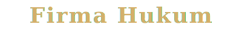

<p align="center">
  
</p>

<h1 align="center">
  
</h1>

<p align="center">
  
</p>

<p align="center">
  
  
  
  
  
  
</p>

<p align="center">
  
  
  
</p>

<br />

<p align="center">
  <strong>Situs profil perusahaan firma hukum profesional dengan dukungan multibahasa (Indonesia & Inggris), formulir kontak terintegrasi email, dan arsitektur berbasis Server Components.</strong>
</p>

<br />

Firma Hukum adalah situs web profil perusahaan yang dibangun untuk menyajikan identitas, layanan, tim, dan konten edukatif sebuah firma hukum kepada calon klien individu maupun korporasi di Indonesia. Sistem ini menggunakan arsitektur Next.js App Router dengan pendekatan Server Components secara default, internasionalisasi (i18n) berbasis kamus statis, dan pengiriman email melalui Nodemailer yang diproses sepenuhnya di sisi server.

---

## Daftar Isi

- [Fitur Utama](#fitur-utama)
- [Teknologi dan Arsitektur](#teknologi-dan-arsitektur)
- [Prasyarat Sistem](#prasyarat-sistem)
- [Instalasi dan Pengembangan Lokal](#instalasi-dan-pengembangan-lokal)
- [Struktur Direktori](#struktur-direktori)
- [Skrip Tersedia](#skrip-tersedia)
- [Panduan Kontribusi](#panduan-kontribusi)
- [Lisensi](#lisensi)
- [Kontak](#kontak)

---

##  Fitur Utama

### Internasionalisasi (i18n) Berbasis Kamus Statis

Sistem mendukung dua bahasa (Indonesia dan Inggris) melalui file kamus (`dictionaries/id.ts` dan `dictionaries/en.ts`). Routing berbasis segmen `[locale]` pada App Router memastikan setiap halaman memiliki versi URL sendiri per bahasa. Middleware mendeteksi locale dari cookie `NEXT_LOCALE` atau mengarahkan ke bahasa default (`id`).

### Formulir Kontak dengan Validasi dan Pengiriman Email

Formulir kontak divalidasi secara real-time di sisi klien menggunakan **React Hook Form** dan **Zod**, kemudian diproses melalui Server Action yang mengirimkan email via **Nodemailer** (SMTP Gmail). Validasi tambahan terhadap format email dan nomor telepon dilakukan melalui **Abstract API** sebelum pengiriman.

### Arsitektur Server Components Default

Seluruh halaman dirender sebagai React Server Components kecuali komponen yang memerlukan interaktivitas klien (formulir, animasi, navigasi mobile). Pendekatan ini meminimalkan JavaScript yang dikirim ke browser dan mempercepat First Contentful Paint (FCP).

### Sistem Artikel dengan Static Site Generation (SSG)

Halaman artikel menggunakan `generateStaticParams` untuk menghasilkan halaman statis pada waktu build. Konten artikel disimpan sebagai data terstruktur di `lib/data/articles.ts` dengan dukungan HTML mentah untuk fleksibilitas format.

### Animasi Scroll-Triggered Berbasis Framer Motion

Komponen `AnimatedElement` memanfaatkan Intersection Observer API melalui hook `useInView` dari **Framer Motion** untuk memicu animasi entrance saat elemen masuk viewport. Sistem menghormati pengaturan `prefers-reduced-motion` secara otomatis melalui CSS.

### Komponen UI Konsisten via shadcn/ui

Seluruh elemen antarmuka (Button, Card, Form, Sheet, Select, dsb.) dibangun menggunakan primitif **shadcn/ui** yang berbasis **Radix UI**, memastikan aksesibilitas (ARIA) dan konsistensi visual tanpa dependensi berat.

### SEO dan Open Graph Terintegrasi

Setiap route menghasilkan metadata dinamis (title, description, Open Graph, Twitter Card) melalui API `generateMetadata` dari Next.js. File `robots.ts` dan `sitemap.ts` di-generate secara otomatis pada waktu build.

---

##  Teknologi dan Arsitektur

### Tech Stack

| Kategori | Teknologi | Versi | Kegunaan |
|---|---|---|---|
| Framework | Next.js (App Router) | 16.2.10 | Routing, SSR, SSG, Server Actions |
| Bahasa | TypeScript | 5.x | Keamanan tipe statis di seluruh codebase |
| UI Library | React | 19.2.4 | Rendering komponen deklaratif |
| Styling | Tailwind CSS | 4.x | Utility-first CSS framework |
| Komponen UI | shadcn/ui + Radix UI | 4.13.0 | Primitif UI yang aksesibel |
| Animasi | Framer Motion | 12.42.2 | Animasi deklaratif dan gesture |
| Ikon | Lucide React | 1.23.0 | Pustaka ikon SVG |
| Formulir | React Hook Form | 7.81.0 | Manajemen state formulir |
| Validasi | Zod | 4.4.3 | Validasi skema berbasis TypeScript |
| Email | Nodemailer | 9.0.3 | Pengiriman email SMTP |
| Toast | Sonner | 2.0.7 | Notifikasi toast ringan |
| Package Manager | pnpm | - | Manajemen dependensi |
| Linter | ESLint | 9.x | Analisis kode statis |
| Formatter | Prettier | 3.9.4 | Pemformatan kode konsisten |
| Deployment | Vercel | - | Platform hosting dan CI/CD |

### Diagram Arsitektur

```
                         +------------------+
                         |     Browser      |
                         +--------+---------+
                                  |
                         +--------v---------+
                         |    Middleware     |
                         |  (Locale Detect) |
                         +--------+---------+
                                  |
                    +-------------+-------------+
                    |                           |
           +-------v--------+         +--------v-------+
           | Server Component|         | Client Component|
           |   (Pages/Layout)|         | (Forms/Navbar)  |
           +-------+--------+         +--------+-------+
                    |                           |
           +-------v--------+         +--------v-------+
           |   Dictionary   |         | React Hook Form |
           |   (id.ts/en.ts)|         |   + Zod Schema  |
           +----------------+         +--------+-------+
                                               |
                                      +--------v-------+
                                      | Server Action  |
                                      | (contact.ts)   |
                                      +--------+-------+
                                               |
                                      +--------v-------+
                                      |   Nodemailer   |
                                      |   (SMTP Send)  |
                                      +----------------+
```

### Pola Arsitektur

Proyek ini menggunakan pola **Feature-Based Organization** yang dikombinasikan dengan **Barrel Exports**. Setiap direktori komponen memiliki file `index.ts` sebagai titik ekspor tunggal, sehingga konsumen cukup mengimpor dari path direktori tanpa perlu mengetahui nama file internal. Pemisahan antara Server Components dan Client Components mengikuti batasan alami Next.js App Router: komponen yang memerlukan hooks, event handler, atau browser API ditandai dengan direktif `"use client"`.

---

##  Prasyarat Sistem

Pastikan perangkat berikut telah terinstal sebelum memulai proses instalasi:

- **Node.js** versi 18.17 atau lebih baru
  - Verifikasi: `node --version`
- **pnpm** sebagai package manager
  - Instalasi global: `npm install -g pnpm`
  - Verifikasi: `pnpm --version`
- **Git** untuk version control
  - Verifikasi: `git --version`
- **Akun Gmail** dengan App Password aktif (untuk fitur pengiriman email formulir kontak)
- **API Key Abstract API** (opsional, untuk validasi email dan nomor telepon)

---

##  Instalasi dan Pengembangan Lokal

1. **Clone Repository**

    ```bash
    git clone https://github.com/sosusesa-bri/FirmaHukum.git
    cd FirmaHukum
    ```

2. **Instal Dependensi**

    ```bash
    pnpm install
    ```

3. **Konfigurasi Environment Variables**

    Salin file `.env.local.example` atau buat file `.env.local` di root proyek dengan variabel berikut:

    | Key | Deskripsi | Contoh Nilai | Wajib |
    |---|---|---|---|
    | `EMAIL_USER` | Alamat email Gmail pengirim | `yourname@gmail.com` | Ya |
    | `EMAIL_PASS` | App Password Gmail (bukan password utama) | `abcdefghijklmnop` | Ya |
    | `EMAIL_RECEIVER` | Alamat email penerima notifikasi kontak | `admin@firmahukum.co.id` | Ya |
    | `ABSTRACT_EMAIL_API_KEY` | API Key dari Abstract API untuk validasi email | `your_api_key_here` | Opsional |
    | `ABSTRACT_PHONE_API_KEY` | API Key dari Abstract API untuk validasi telepon | `your_api_key_here` | Opsional |

    ```env
    EMAIL_USER=yourname@gmail.com
    EMAIL_PASS=your_gmail_app_password
    EMAIL_RECEIVER=admin@firmahukum.co.id
    ABSTRACT_EMAIL_API_KEY=your_abstract_email_key
    ABSTRACT_PHONE_API_KEY=your_abstract_phone_key
    ```

4. **Jalankan Server Pengembangan**

    ```bash
    pnpm run dev
    ```

5. **Verifikasi Instalasi**

    Buka browser dan akses `http://localhost:3000`. Sistem akan otomatis mengarahkan ke `http://localhost:3000/id` (locale default Bahasa Indonesia). Pastikan halaman beranda tampil lengkap dengan Hero section, statistik, area praktik, tim, dan formulir kontak.

---

##  Struktur Direktori

```
firma-hukum/
├── app/
│   ├── [locale]/
│   │   ├── (marketing)/
│   │   │   ├── artikel/
│   │   │   ├── kontak/
│   │   │   ├── layanan/
│   │   │   ├── tentang-kami/
│   │   │   ├── tim/
│   │   │   ├── layout.tsx
│   │   │   └── page.tsx
│   │   ├── layout.tsx
│   │   └── not-found.tsx
│   ├── actions/
│   │   ├── contact.ts
│   │   └── newsletter.ts
│   ├── globals.css
│   ├── icon.svg
│   ├── robots.ts
│   └── sitemap.ts
├── components/
│   ├── forms/
│   │   └── contact-form.tsx
│   ├── layout/
│   │   ├── footer.tsx
│   │   ├── navbar.tsx
│   │   └── index.ts
│   ├── sections/
│   │   ├── hero.tsx
│   │   ├── statistics.tsx
│   │   ├── practice-areas.tsx
│   │   ├── why-choose-us.tsx
│   │   ├── team-preview.tsx
│   │   ├── testimonials.tsx
│   │   ├── cta.tsx
│   │   └── index.ts
│   ├── shared/
│   │   ├── animated-element.tsx
│   │   ├── container.tsx
│   │   ├── page-hero.tsx
│   │   ├── section-heading.tsx
│   │   ├── section-wrapper.tsx
│   │   ├── social-icons.tsx
│   │   └── index.ts
│   └── ui/
│       ├── accordion.tsx
│       ├── badge.tsx
│       ├── button.tsx
│       ├── card.tsx
│       ├── form.tsx
│       ├── input.tsx
│       ├── label.tsx
│       ├── navigation-menu.tsx
│       ├── select.tsx
│       ├── separator.tsx
│       ├── sheet.tsx
│       └── textarea.tsx
├── constants/
│   └── site.ts
├── dictionaries/
│   ├── id.ts
│   └── en.ts
├── hooks/
│   └── use-scroll-position.ts
├── lib/
│   ├── data/
│   │   ├── articles.ts
│   │   ├── practice-areas.ts
│   │   ├── statistics.ts
│   │   └── team-members.ts
│   ├── dictionary.ts
│   ├── i18n.ts
│   └── utils.ts
├── public/
│   └── images/
├── types/
│   └── index.ts
├── middleware.ts
├── next.config.ts
├── tailwind.config.ts
├── tsconfig.json
└── package.json
```

### Penjelasan Pola Desain Direktori

| Direktori | Fungsi | Alasan Pola |
|---|---|---|
| `app/[locale]/(marketing)/` | Route group untuk halaman publik dengan segmen locale dinamis | Memisahkan route marketing dari route lain (misal: admin), sekaligus menyisipkan locale sebagai segmen URL otomatis |
| `app/actions/` | Server Actions untuk pemrosesan formulir dan mutasi data | Menempatkan logika server di satu lokasi yang terisolasi dari komponen UI |
| `components/sections/` | Komponen section khusus halaman beranda (Hero, CTA, dsb.) | Memisahkan section page-specific dari komponen reusable |
| `components/shared/` | Komponen utilitas yang digunakan lintas halaman | Menghindari duplikasi kode untuk elemen umum (Container, SectionHeading) |
| `components/ui/` | Primitif UI dari shadcn/ui | Mengikuti konvensi shadcn/ui agar mudah di-update via CLI |
| `components/layout/` | Komponen tata letak global (Navbar, Footer) | Memisahkan shell aplikasi dari konten halaman |
| `constants/` | Konfigurasi statis (identitas situs, navigasi) | Single source of truth untuk data yang tidak berubah antar request |
| `dictionaries/` | File kamus terjemahan per locale | Pendekatan i18n tanpa dependensi eksternal, langsung di-import sebagai modul TypeScript |
| `lib/data/` | Data statis terstruktur (artikel, tim, statistik) | Memisahkan data dari logika rendering agar mudah diganti dengan CMS atau API di masa depan |
| `hooks/` | Custom React hooks | Mengisolasi logika stateful yang dapat di-reuse di berbagai komponen klien |
| `types/` | Definisi tipe TypeScript bersama | Satu titik referensi untuk interface dan type yang digunakan lintas modul |

Setiap subdirektori `components/` yang berisi lebih dari satu file dilengkapi file `index.ts` sebagai **barrel export**, memungkinkan pola import yang ringkas:

```typescript
// Barrel export pattern
import { Hero, Statistics, CTA } from "@/components/sections";
```

---

##  Skrip Tersedia

| Perintah | Deskripsi | Environment |
|---|---|---|
| `pnpm run dev` | Menjalankan server pengembangan Next.js dengan Turbopack | Development |
| `pnpm run build` | Membuat bundle produksi yang dioptimasi | Production |
| `pnpm run start` | Menjalankan server produksi dari hasil build | Production |
| `pnpm run lint` | Menjalankan ESLint untuk analisis kode statis | Development |

---

##  Panduan Kontribusi

### Alur Branching

Proyek ini menggunakan pola **trunk-based development** dengan branch `main` sebagai cabang utama.

```bash
# Buat branch fitur dari main
git checkout main
git pull origin main
git checkout -b feat/nama-fitur

# Setelah selesai, push dan buat Pull Request
git push origin feat/nama-fitur
```

### Format Commit Message

Gunakan format **Conventional Commits** untuk seluruh commit:

```
<tipe>: <deskripsi singkat>

[isi opsional]
```

Tipe yang diizinkan:

| Tipe | Penggunaan |
|---|---|
| `feat` | Fitur baru |
| `fix` | Perbaikan bug |
| `refactor` | Perubahan kode tanpa mengubah perilaku |
| `docs` | Perubahan dokumentasi |
| `style` | Perubahan format (spasi, titik koma, dsb.) |
| `chore` | Pemeliharaan (update dependensi, konfigurasi) |
| `perf` | Peningkatan performa |
| `test` | Penambahan atau perbaikan tes |

Contoh:

```bash
git commit -m "feat: tambah validasi nomor telepon pada formulir kontak"
git commit -m "fix: perbaiki navigasi mobile yang tidak menutup saat berpindah halaman"
git commit -m "docs: perbarui panduan instalasi pada README"
```

### Standar Kode Sebelum Pull Request

Pastikan langkah berikut telah dilakukan sebelum mengajukan Pull Request:

1. Jalankan linter tanpa error:
    ```bash
    pnpm run lint
    ```
2. Jalankan formatter untuk konsistensi kode:
    ```bash
    npx prettier --write .
    ```
3. Pastikan build produksi berhasil tanpa error:
    ```bash
    pnpm run build
    ```
4. Verifikasi tampilan di browser pada resolusi desktop dan mobile.

---

##  Lisensi

Proyek ini bersifat **proprietary** dan tidak dilisensikan untuk penggunaan publik. Silakan merujuk pada file [LICENSE](LICENSE) untuk melihat keseluruhan **Perjanjian Lisensi Perangkat Lunak Berpemilik (Proprietary Software License Agreement)**.

Hak Cipta &copy; 2026 Firma Hukum. Seluruh hak dilindungi undang-undang.

---

##  Kontak

Untuk pertanyaan teknis atau kolaborasi terkait proyek ini:

- **Email**: thelawticsa@gmail.com
- **Alamat**: Jl. AH. Nasution No.105, Cipadung Wetan, Kec. Cibiru, Kota Bandung, Jawa Barat 40614

---

<p align="center">
  
</p>

<p align="center">
  
</p>

<p align="center">
  <sub>Hak Cipta &copy; 2026 Firma Hukum. Seluruh hak dilindungi undang-undang.</sub>
</p>
